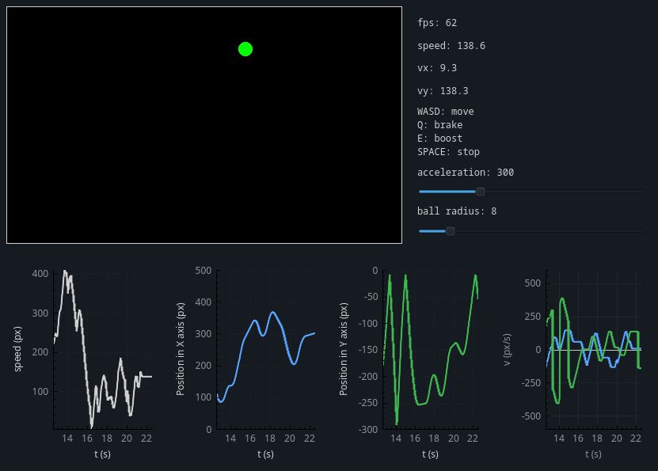

# Hi, this is my first Qt6 project.

The goal was to experiment with **basic** kinematics and get familiar with simulation and real-time plotting.

The GUI is built using Qt6, with real-time graphs powered by QCustomPlot.
The physics is implemented using simple Euler integration, updated in a fixed timestep loop.

## Preview



## How to build

### Requirements
- Qt6
- CMake (>= 3.x)
- C++ compiler (GCC / Clang / MSVC)

### Build steps

```bash
git clone https://github.com/rrocas/kinematics-sim.git
cd kinematics-sim
mkdir build
cd build
cmake ..
make
```

## Known issues:

- Frame drop at high speed
- The letter "Q" does not fully stop the ball
- Some layout and visual glitches are still present